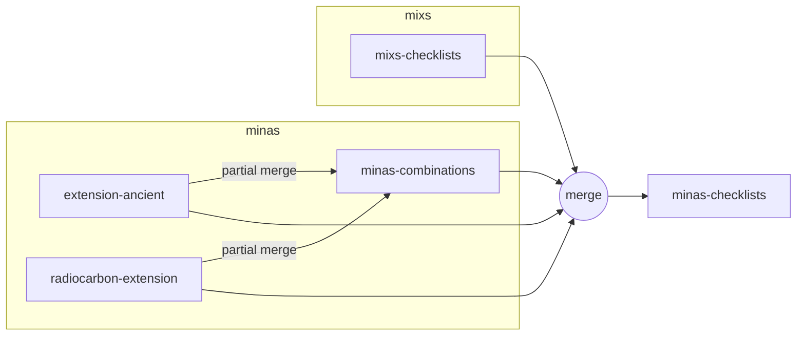

# Release protocol

This document outlines the protocol for releasing new versions of the project.

## Overview

## Release process

1. Update and release extensions
    - Ancient extension (`MIxS-MInAS/extension-ancient`). Instructions [here](https://github.com/MIxS-MInAS/extension-ancient?tab=readme-ov-file#update-workflows).
    - Radiocarbon dating extension (`MIxS-MInAS/extension-radiocarbon-dating`). Instructions [here](https://github.com/MIxS-MInAS/extension-radiocarbon-dating?tab=readme-ov-file#update-workflows).
2. Transfer extension updates to MInAS combinations (`MIxS-MInAS/minas-combinations`)
3. Release MInAS combinations
4. [Merge all MInAS schemas](https://github.com/mixS-MInAS/minas?tab=readme-ov-file#release) with latest MIxS checklist release to make MInAS checklists (`MIxS-MInAS/MInAS`). You should merge:
    - Ancient extension (`MIxS-MInAS/extension-ancient`)
    - Radiocarbon dating extension (`MIxS-MInAS/extension-radiocarbon-dating`)
    - MInAS combinations (`MIxS-MInAS/minas-combinations`)
    - MIxS checklists (`GenomicsStandards Consortium/mixs`)
5. [Release](https://github.com/MIxS-MInAS/MInAS/releases) MInAS checklists (`MIxS-MInAS/MInAS`) following [these instructions](https://github.com/MIxS-MInAS/MInAS?tab=readme-ov-file#release).
6. [Update](https://github.com/MIxS-MInAS/MInAS-DataHarmonizer/blob/master/mixs-minas-instructions.md#creating-the-dataharmonizer-compatible-schema) Data Harmonizer (`MIxS-MInAS/MInAS-DataHarmonizer`) with latest MInAS checklists
