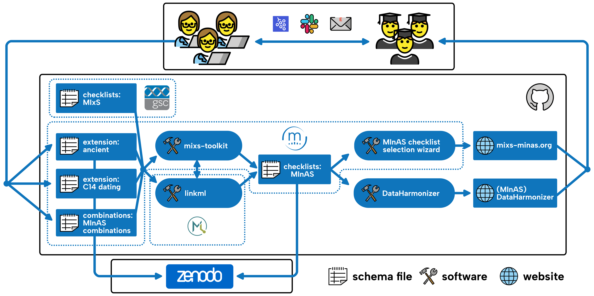
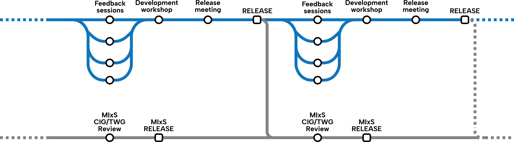

# Project Management Overview

These pages in this section of the documentation describes the processes and procedures that the MInAS project team will follow to ensure the project is run smoothly.

-   [Running feedback sessions](feedback-session-protocol.md): A protocol for running feedback sessions with communities and groups to gather feedback on the MInAS metadata schema.
-   [Example Use Cases](example-sample-data-description-use-cases.md): A collection of examples of sample and data descriptions that contributors should prepare before a feedback session for propagating into a MInAS checklist

Below are short descriptions of the project infrastructure and timeline for each MInAS release.

=== "Infrastructure Overview"

    

    At it's core, MInAS consists of MIxS-style LinkmL YAML files.
    There is one per extension, plus a combination file that defines which fields go into which MIxS checklist.
    Once the different extensions are updated, we use a combination of LinkML commands and a toolkit developed by the MInAS team (mixs-toolkit) to combine the MInAS extensions with the current version of MIxS to generate the final set of MInAS checklists.

    These we then use the information from the combinations to update the contents of a 'selection wizard' that helps users select the right checklist for describing their samples.
    At the same time, we then pass the final MInAS LinkML YAML file to a slightly modified version of the DataHarmonizer tool which helps the aDNA community to review the proposed metadata terms.
    Both the selection wizard and DataHarmonizer interface are rendered on the MInAS website.

    We use both tools within what we term 'feedback sessions' that where have online calls where we consult with a wide variety of different stakeholders in ancient DNA research for the applicability and usefulness of the proposed metadata terms.
    We The MInAS team then collates and reviews the feedback from these sessions, and then updates the MInAS extensions and checklists YAML files accordingly.

=== "Project Timeline Overview"

    

    The regular project timeline of the MInAS project is envisioned to be as follows:

    1. **Feedback sessions**: We run multiple feedback sessions with different members of the community to gather feedback on the next updates to the MInAS metadata schema.
    2. **Development workshop**: after multiple feedback sessions, the development team comes together into a workshop to review and build consensus on the feedback received, and finalise the proposed updates.
    3. **Release meeting**: The MInAS coordinators then incorporate the proposed changes into the LinkML YAML files makes GitHub releases, and updates the MInAS website with the new checklists and DataHarmonizer interface.
    4. **GSC MIxS Review**: (_Envisioned_) After we make a new release of the MInAS schemas, the development team will then submit our changes to the main MIxS project for review and incorporation into the main MIxS project and it's subsequent MIxS release that then are then taken and implemented by the ENA and other data archives.
