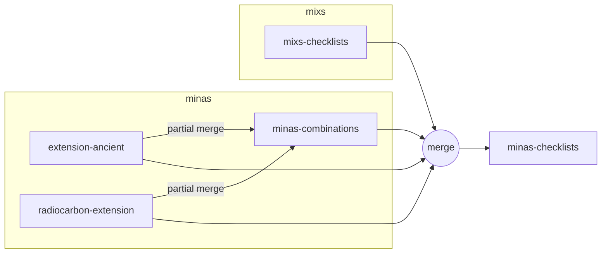

# Release protocol

This document outlines the protocol for releasing new versions of the project.

## Overview

## Release process

1. Update and release extensions
    - Ancient extension
    - Radiocarbon dating extension
2. Transfer extension updates to MInAS combinations
3. Release MInAS combinations
4. Merge all MInAS schemas with latest MIxS checklist release to make MInAS checklists
    - Ancient extension
    - Radiocarbon dating extension
    - MInAS combinations
    - MIxS checklists
5. Release MInAS checklists
6. Update Data Harmonizer with latest MInAS checklists
