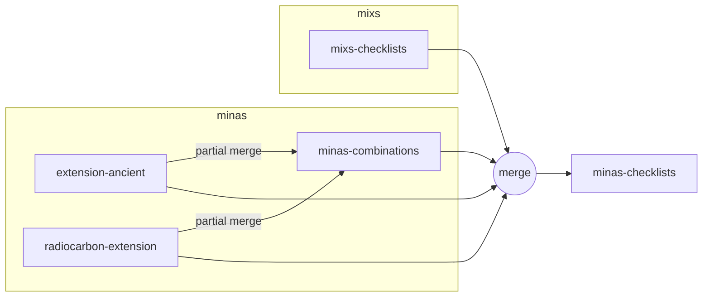

# Release protocol

This document outlines the protocol for releasing new versions of the project.

## Overview

## Release process

1. Update and release extensions
    - Ancient extension (`MIxS-MInAS/extension-ancient`)
    - Radiocarbon dating extension (`extension-radiocarbon-dating`)
2. Transfer extension updates to MInAS combinations (`minas-combinations`)
3. Release MInAS combinations
4. Merge all MInAS schemas with latest MIxS checklist release to make MInAS checklists (`MIxS-MInAS`)
    - Ancient extension (`MIxS-MInAS/extension-ancient`)
    - Radiocarbon dating extension (`MIxS-MInAS/extension-radiocarbon-dating`)
    - MInAS combinations (`MIxS-MInAS/minas-combinations`)
    - MIxS checklists (`GenomicsStandards Consortium/mixs`)
5. Release MInAS checklists (`MIxS-MInAS/minas`)
6. Update Data Harmonizer (`MIxS-MInAS/MInAS-DataHarmonizer`) with latest MInAS checklists
