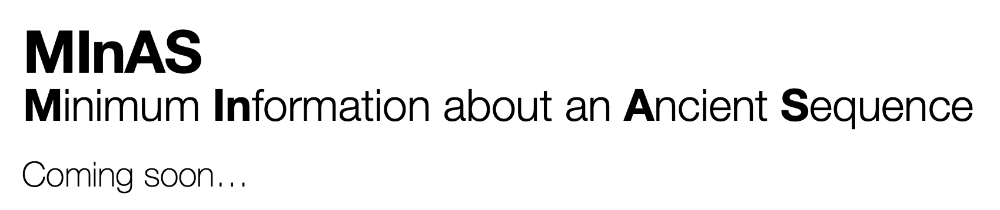

# 

## About

- 💾 Palaeogenomic data is routinely shared on public databases
- 🏷️ Metadata? Not so good…

> Standardised metadata reporting of ancient DNA sequencing data via community-based consensus and training.

Please see the [proposal](/proposal.md) to be submitted to the [Genomics Standards Consortium's](https://www.gensc.org/) [MIxS project](https://www.gensc.org/pages/standards-intro.html).

Currently, the MINAS project is being spearheaded by the [SPAAM Community](https://spaam-community.github.io). If you're interested in getting involved in the project, please join the [SPAAM Slack](https://join.slack.com/t/spaam-community/shared_invite/zt-ei8pfw4m-XdBGTQwRaXWrEkd618YlhQ) and join the channel [#metadata-standards](https://spaam-community.slack.com/archives/C01BX7EM4EL).

We are activately looking for other palaeogenomic communities and groups to get involved with the project - please get in contact if you are interested.
