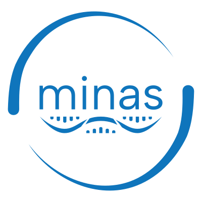

<h1>

   

</h1>

## About

- 💾 Palaeogenomic data is routinely shared on public databases
- 🏷️ Metadata? Not so good…

_The **M**inimum **In**formation about any **A**ncient **S**equence (**MInAS**) project aims to develop standardised metadata reporting schemes of ancient DNA samples and sequencing data via community-based consensus and training._

This project builds from and interacts with the [Genomics Standards Consortium's](https://www.gensc.org/) (GSC) [MIxS project](https://www.gensc.org/pages/standards-intro.html).

See the [project proposal](/proposal) submitted to the GSC for further context and motivations behind the project. For the planned phases of the project, see [Project Phases](/phases). To see the latest drafts, please see the respective [Draft](/drafts) page.

🤝 We are activately looking for other palaeogenomic communities and groups to get involved with the project - please get in contact if you are interested.

The MInAS project was originally spearheaded by the [SPAAM Community](https://spaam-community.github.io), however we are in the process of extending to all areas of palaeogenomics.

If you're interested in getting involved in the project, please see [Get Involved](/get-involved).

For more information, see our communication channels in [Get Involved](/get-involved) or [Contact](/contact).
