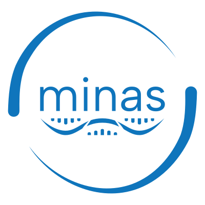

<h1>

   

</h1>

## About

-   💾 Palaeogenomic data is routinely shared on public databases
-   🏷️ Metadata? Not so good…

_The **M**inimum **In**formation about any **A**ncient **S**equence (**MInAS**) project aims to develop standardised metadata reporting schemes for any ancient DNA sample and sequencing data via community-based consensus and training._

!!! success Latest

      MInAS is now formally incorporated into the [Genomics Standards Consortium's](https://www.gensc.org/) (GSC)  MIxS as of version [7.0](https://genomicsstandardsconsortium.github.io/mixs/), and is in process of being implemented into genomic sequencing data repositories.

## How to view

To view the latest version of the MInAS schema, please see the [MInAS DataHarmonizer](https://www.mixs-minas.org/MInAS-DataHarmonizer/), or see the pages of the dedicated ['ancient' extension](schema/ancient-extension.md) collection of terms.

Use the 'Template' dropdown to select a relevant [combination](schema/combinations.md), and the help sidebar for metadata term definitions.

For more details see the [drafts](schema/index.md) pages.

🤝 We are actively looking for other palaeogenomic communities and groups to get involved with the project - please see [Get Involved](contact.md) if you are interested.

👨‍👩‍👧‍👦 The MInAS project was originally spearheaded by the [SPAAM Community](https://spaam-community.github.io), however has developed it's own community encompassing all areas of palaeogenomics.

❓ For more information, see our communication channels in [Get Involved]contact.md).
